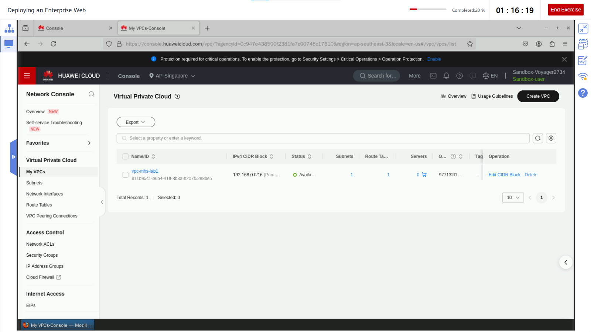
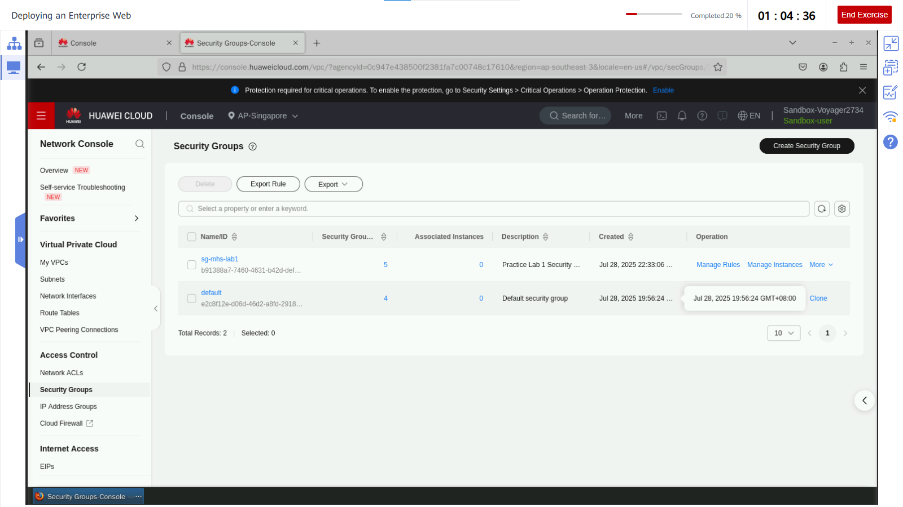
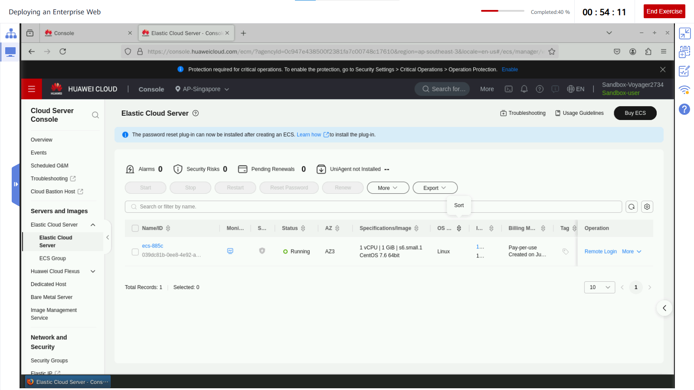
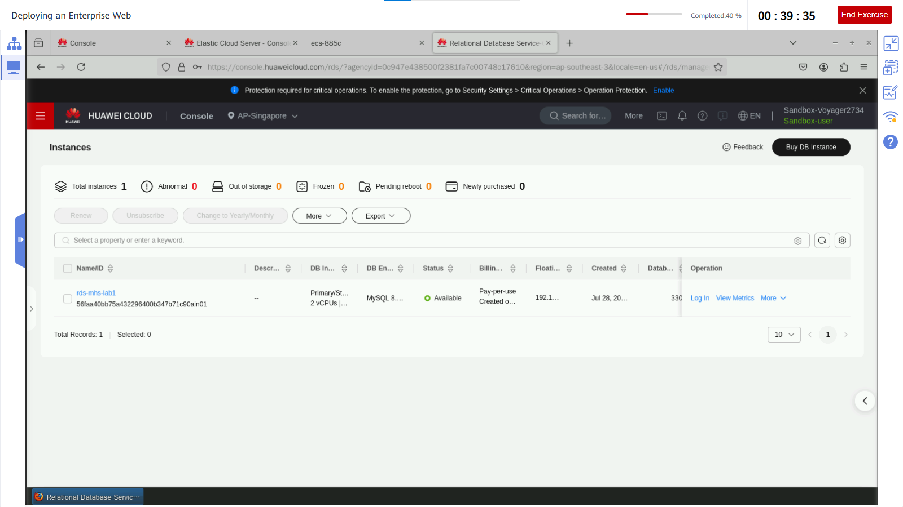

# Lab 1: Deploying an Enterprise Web on Huawei Cloud

## Objective
Deploy a website on Huawei Cloud using ECS for the web server and RDS for the database, integrated in a secure VPC environment.

---

## Step 1: Create VPC

- Go to: **Service List > Networking > Virtual Private Cloud**
- Click **Create VPC**
  - **Region**: AP-Singapore
  - **Name**: `vpc-mp`
  - **Other Settings**: Leave defaults
 

---

## Step 2: Create Security Group

- Navigate to: **Access Control > Security Groups**
- Create a new security group
  - Add an **Inbound Rule**:
    - **Protocol & Port**: All
    - **Source**: `0.0.0.0/0`

---

## Step 3: Buy ECS

- Go to: **Compute > Elastic Cloud Server > Buy ECS**
- Settings:
  - **Billing Mode**: Pay-per-use
  - **Region**: AP-Singapore
  - **Specifications**: `s6.small.1`, 1 vCPU, 1 GB RAM
  - **Image**: CentOS 7.6 (64-bit)
  - **System Disk**: High I/O, 40 GB
  - **Network**: Use the VPC and Security Group created above
  - **EIP**: Automatically assign public IP
  - **Login Mode**: Password (set e.g. `Huawei@123!`)
- Click **Submit**

---

## Step 4: Buy RDS MySQL Instance

- Go to: **Database > RDS > Buy DB Instance**
- Settings:
  - **DB Engine**: MySQL 8.0
  - **Edition**: Primary/Standby
  - **Specifications**: 2 vCPUs, 4 GB RAM
  - **VPC & Subnet**: Same as ECS
  - **Security Group**: Same as ECS
  - **DB Password**: e.g. `Huawei!@#$`
- Click **Buy Now**

---
